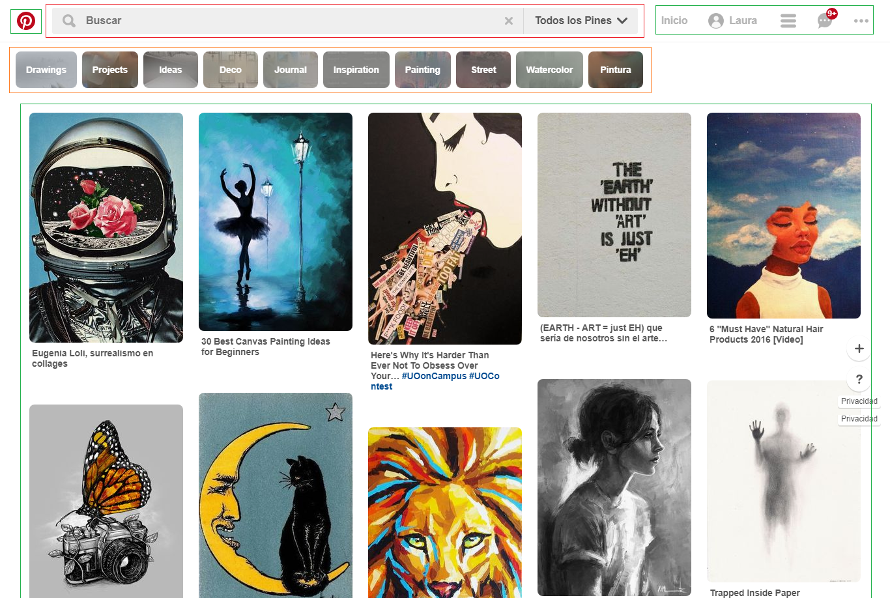
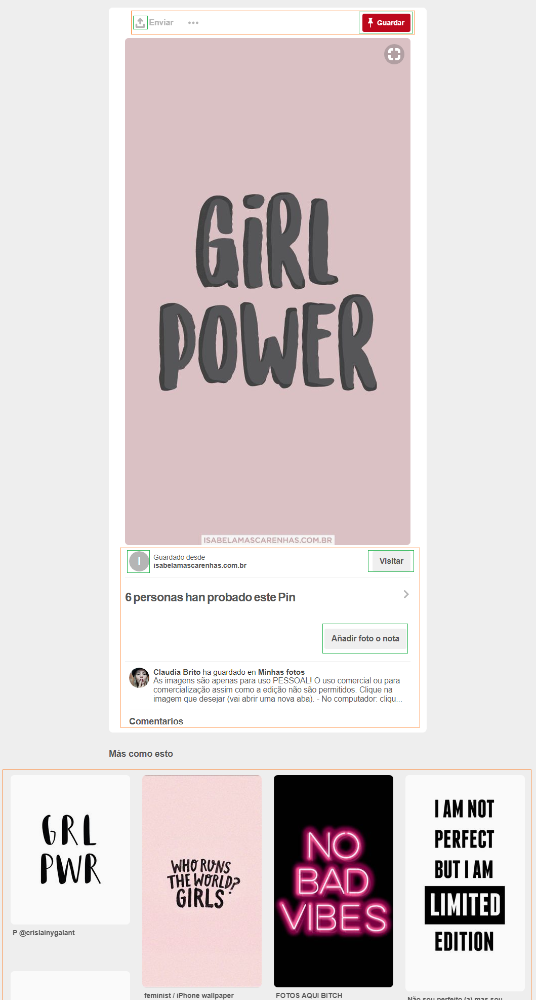
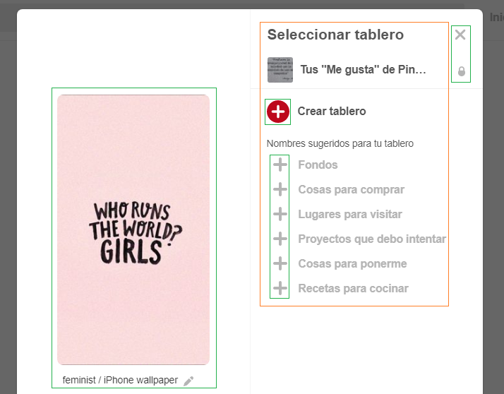

# Reto 1 - UX & UI

## Objetivo:
Elige una web y explica qué partes conforman el UX y qué partes el UI.

## Web elegida:
__PINTEREST__

## Leyenda:

- Verde: UI
- Anaranjado: UX

## Resultado:

| __UX__                |             __UI__    |
| :---------------------: | :---------------------: |
| El buscador facilita al usuario. | Diseño del logo, colores y forma. |
| Facilitar categorias de lo que buscaste. | Iconos |
| Tener un boton de poder guardar la imagen en tu tablero. | Forma de las imagenes y orden. |
| Poder directamente enviar la imagen a cualquier usuario o compartirla en redes sociales. | Tipografia. |
| Dar informacion sobre la imagen que elegiste, como por ejemplo: usuario,comentarios,etc. | Botones. |
| Al elegir una imagen te da mas imagenes relacionadas con ella. |  |
| Opciones para guardar en un tablero o crearlo, y tambien opciones de nombres.  | |

## Autora:

Laura Jimenez Hidalgo.